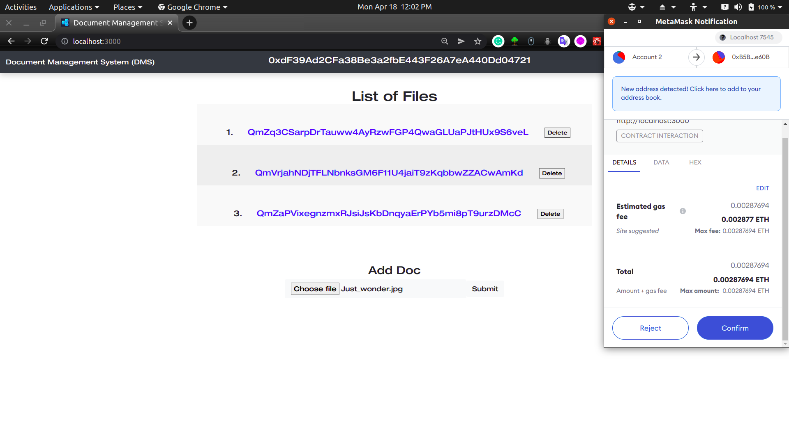

## Document Management System Using Blockchain, IPFS, and Metamask

This repository is aimed at creating a document management system using blockchain, interplanetary file storage system(IPFS), authentication using metamask.

The current repository is still in work. The earlier version of the repository used Infura to provide an indirect access to IPFS. Under new regulations, this has been deprecated. So following changes need to be implemented:-
<ul>
    <li> Creating an account on IPFS, and directly connecting the webApp to the IPFS.
    <li> Writing a solidity script for unique authentication using Metamask.
</ul>

<h3>Technologies Used</h3>

React, NodeJS, Solidity, IPFS, Metamask, Ganache(for development testing), truffle(for compilation and deployment of smart contracts on localhost).

<h3>Result(For Now)</h3>

Document Management System</img>

  